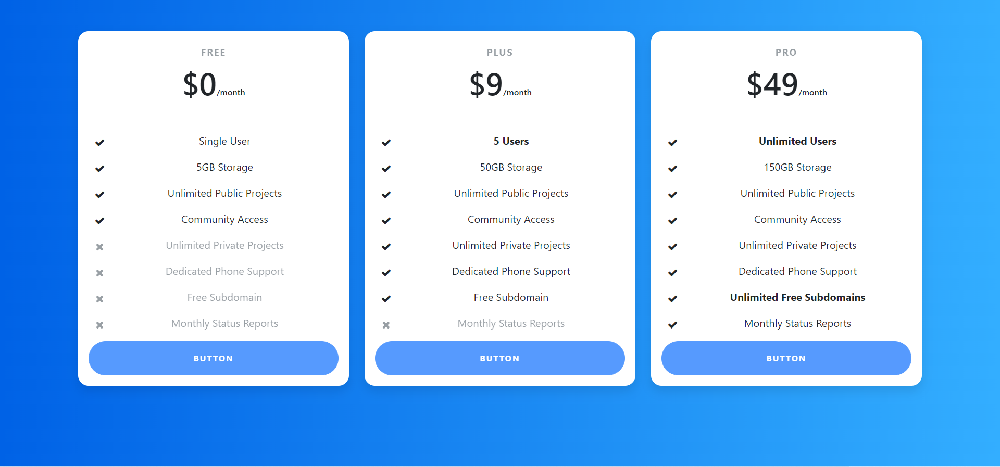

# Bootstrap Pricing Table using React JS

## Table of contents

- [Overview](#overview)
  - [Screenshot](#screenshot)
  - [Links](#links)
- [My process](#my-process)
  - [Built with](#built-with)
  - [What I learned](#what-i-learned)
  - [Continued development](#continued-development)
  - [Useful resources](#useful-resources)
- [Author](#author)
- [Acknowledgments](#acknowledgments)

**Note: Delete this note and update the table of contents based on what sections you keep.**

## Overview

### Screenshot



### Links

- Solution URL: [https://github.com/DwarakanathAkkala/pricing-table-component-json-react]
- Live Site URL: [https://pricing-table-component-json-react.netlify.app/]

## My process

### Built with

- JSX
- Bootstrap
- [React](https://reactjs.org/) - JS library

### What I learned

```jsx
<div className="row">
  {data.map((value, index) => {
    return (
      <div className="col-lg-4" key={index}>
        <Card
          plan={value.plan}
          price={value.price}
          description={value.description}
        />
      </div>
    );
  })}
</div>
```

### Useful resources

- [https://startbootstrap.com/snippets/pricing-table] - This helped me in having a functoning and responsive code snippet.

## Author

- LinkedIN - [@Dwarakanath AKkala](https://www.linkedin.com/in/dwarakanath-akkala-77a849136/)
- GITHub - [@DwarakanathAKkala](https://github.com/DwarakanathAkkala)

## Acknowledgments

This is basic React Project with Bootstrap Responsive Pricing Table. It is to show case the basic structure of Component based React JS Web Application.
